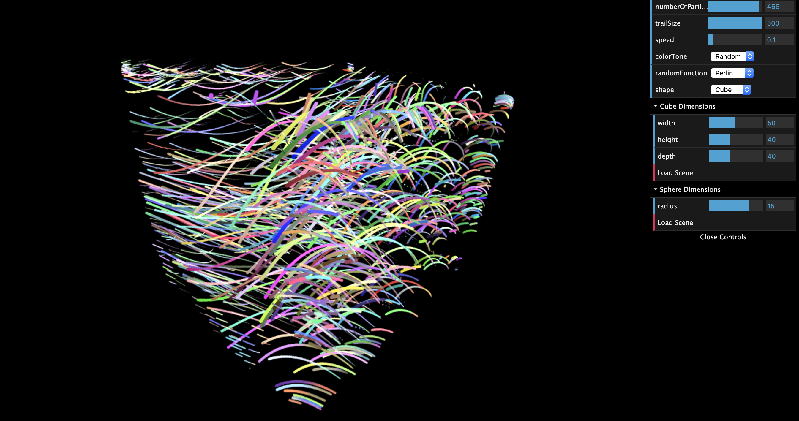
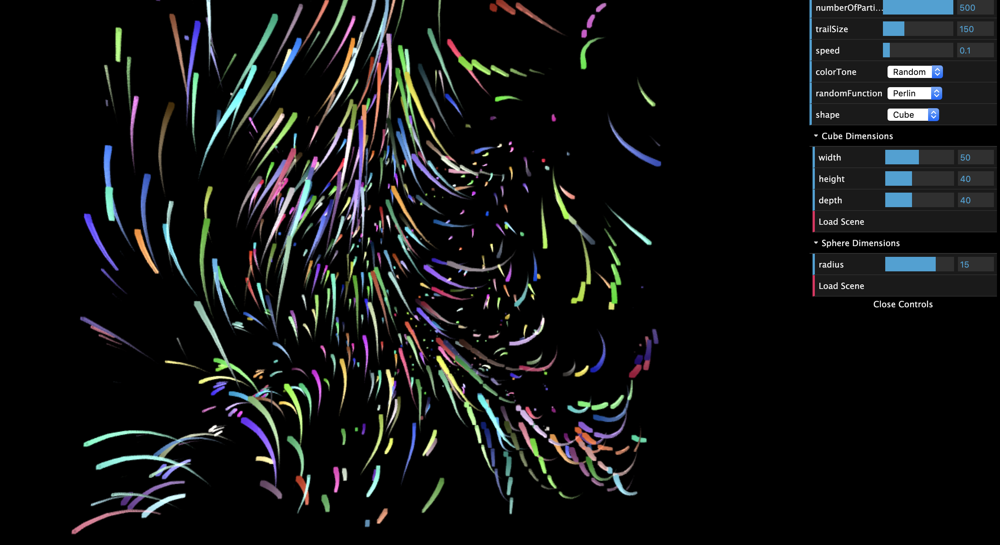
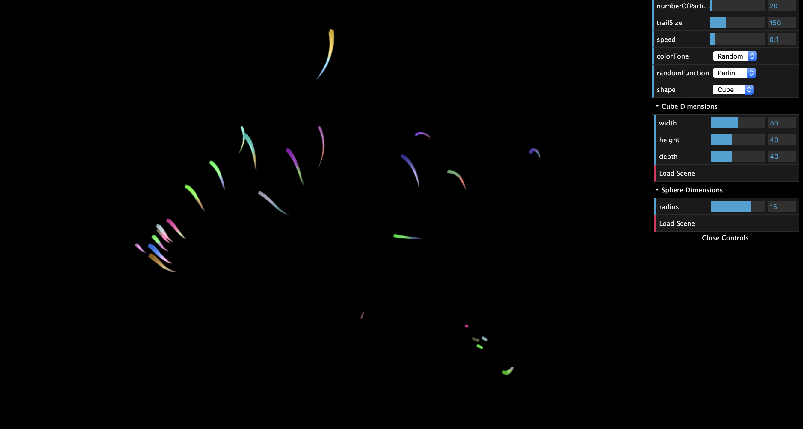
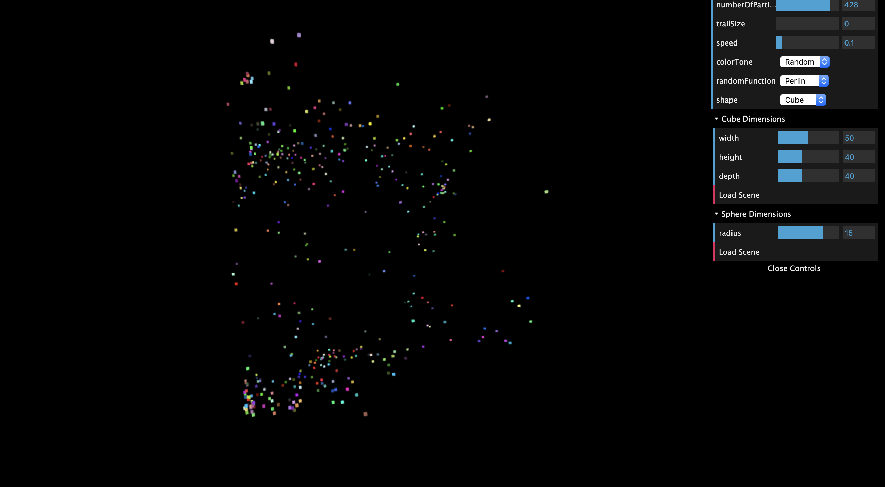
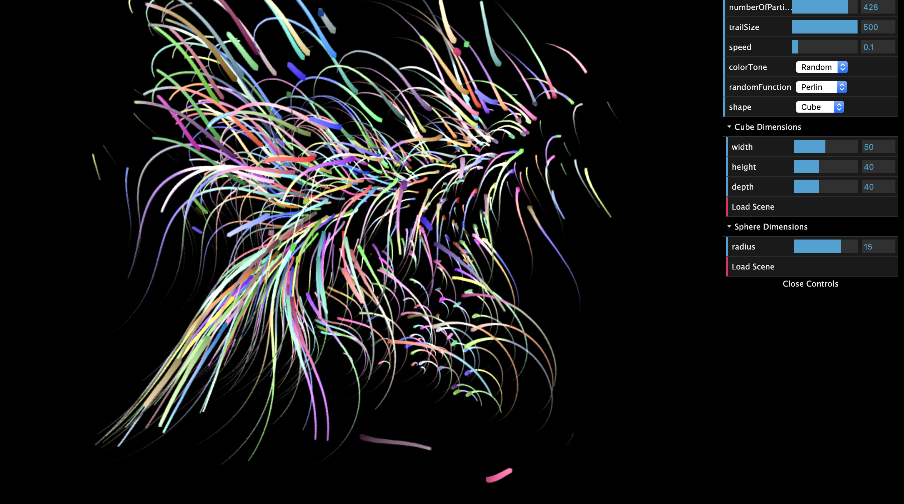
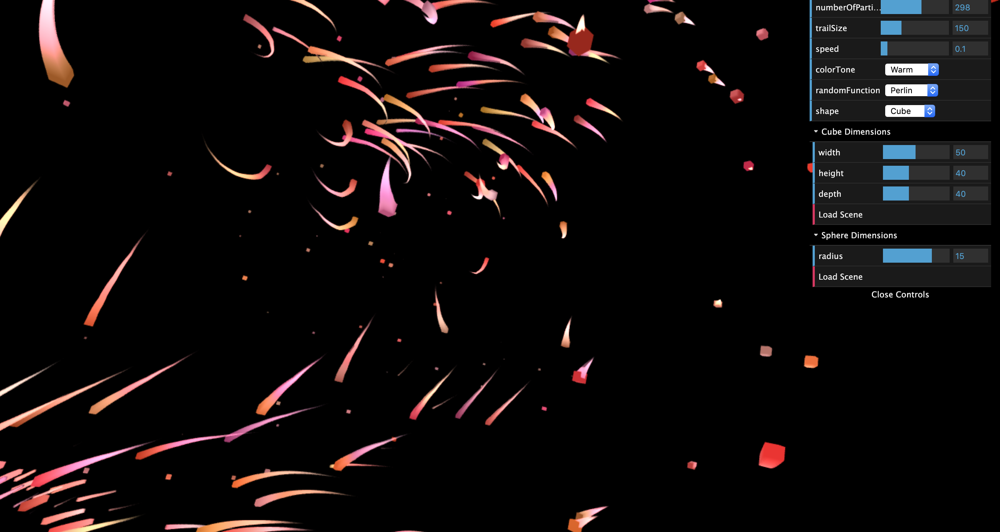
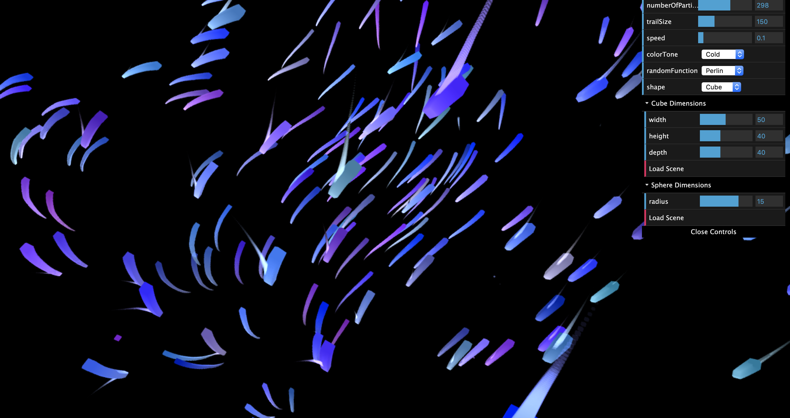
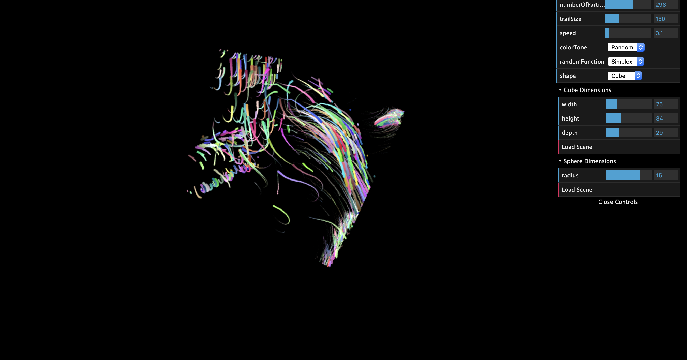
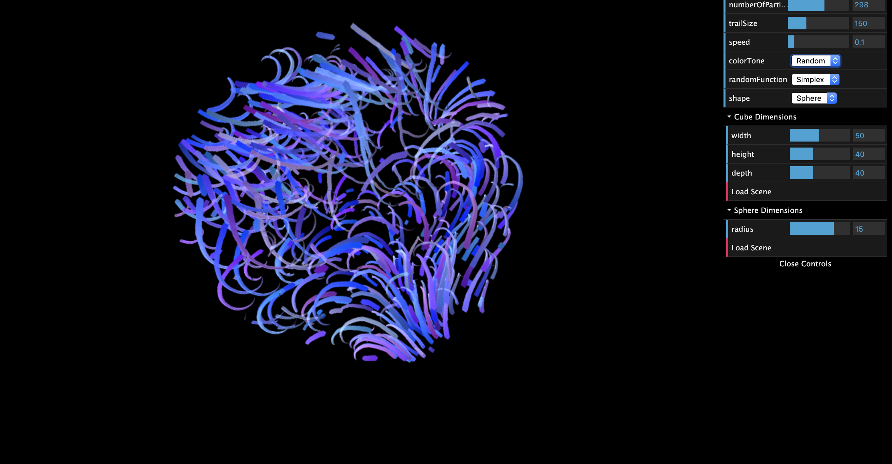

# Final Project: Particles in Flow Field

Spring 2020  
Iciar Andreu Angulo  
PennKey: iciar  
https://iciara.github.io/Procedural-FinalProject/

## Main Features
This project consists of creating an abstract drawing by having particles draw their trail as they move through a flow field. The flow field is calculated using a noise function (Perlin noise or Simplex noise) to get the rotation and length at each cell of the flow field. Then, a set of particles is created at a random position in the flow field and they moved based on the rotation and length (speed) of the cell they are at in the flow field, creating a trail as they move that becomes the drawing.

## GUI Features
- **Number of Particles**: Change the number of particles created.  
High number of particles (particles = 500):

Low number of particles (particles = 20):

- **Particle Trails**: Size of the trail behind each particle.  
No trail (trailSize = 0):

High trail (trailSize = 500):

- **Speed**: increase or decrease the speed at which the particles are moving.

- **Color Tone**: Modifies the overall color of the particles.  
Random (the color of the particles are random and change to another random color through time):

Warm (the colors are random but with a larger weight towards red):

Cold (the colors are random but with a larger weight towards blue):

- **Random Function**: Choose between Perlin noise or Simplex noise as the function to calculate the flow field.  

- **Shape**: The shape that encloses the flow field (shape of the area where the particles are moving):  
Cube:

Cold (the colors are random but with a larger weight towards blue):

- **Cube Dimensions**: Change the dimensions of the cube that encloses the flow field. Click 'Load Scene' to generate the new cube.  

- **Random Function**: Change the dimensions of the sphere that encloses the flow field. Click 'Load Scene' to generate the new sphere.  

## Build Instructions
To build the project you need to install Node.js and then run 'npm install' and then 'npm start'.

## Resources
- Main Source: https://codepen.io/DonKarlssonSan/post/particles-in-simplex-noise-flow-field?__cf_chl_captcha_tk__=28e932886c65fd5af2a6756c0230416e6e3a082f-1585758273-0-AW80JTn9obOVC9gFNYzHSEW7kRBPLqNc10G_IzC00cJuTZjLBC4t-wh0NGRKurX2udSqabaM9ctbRRW4S_wWyihNsNJmH10mlXdwaFDnegxFvbHK_cGnGv6c8Pxts4F-DY2NzNwEj_1fows8sxr7BAxrxYFwk2Ajwx6EjNP9SlTIYDDSeZ2nOZzc63HAoV5IX5RujP00KGXdbAtt4xsAkqmiEcsae_KZAurqw_8X_Yu_6oOtOvf5liPZtazjVR5mj-hqawwbvy1qS1vwamrm7KuAyo2BqBGwu_SaXDsMXjDZWmhI8M5iqEytE-al66BH5_ybcNta2kI32n3k2KQSQomkTSEuQiM-tudh3S-lkTxBpILqY6v_yy1gx5gYsoEIPSvI9dY60CclypRoYSc4ip6g-I-shkJwxJf5WlRnUyQQ4G-7xOkWHfmjSy9g5yVHTM4jHM_xnvQJyPrsOccgwKy_sWYbzW0U8jvblG-JThzAV9YehKQTpOYw_pVaqhSLH_m0p9oAyGKfSaZLcHf-PgztNS3dcgpH-wnVa9iZb6Mc_fJ_efcAHkmKVI2BPoDAKX9egv9vSRNo4Dqca50Jc_c_xQc6EijZUuUgQpaSzjom3hv0L3S_D06SNmkt_Bp-1A
- https://www.youtube.com/watch?v=BjoM9oKOAKY
- https://codepen.io/DonKarlssonSan/pen/jBWaad
